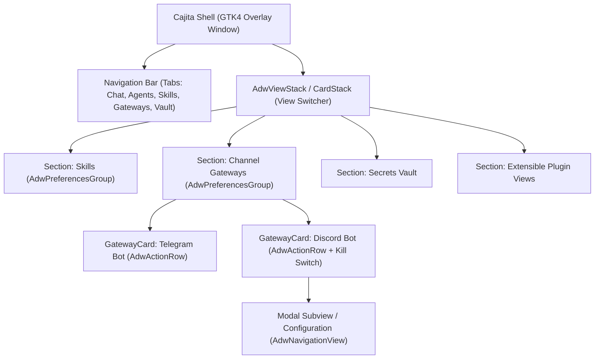

# Sayri Cajita UI SDK: Extensible Interface Specification

**Sayri Cajita** is the primary visual interface of the Sayri copilot on **Pulsar OS**. Designed following the design principles of **GNOME 47+ and Libadwaita**, Cajita acts as an extensible UI container (similar to `AdwPreferencesWindow` and `AdwViewStack`) where system features, AI agents, skills, channel gateways, and security controls are mounted declaratively.

Instead of hardcoding widgets inside a monolithic view, Cajita provides an **Extensible UI Component SDK** that allows plugins, extensions, and core modules to register new sections or contribute interactive cards, switches, badges, and configuration flows.

---

## 1. Architectural Philosophy



### Core Design Principles:
1. **Declarative Component Hierarchy**: Every section is an `AdwPreferencesGroup`-equivalent container holding modular `CajitaCard` items.
2. **Strict Visual Consistency**: All widgets adhere to Pulsar OS dark theme tokens (`#0f172a`, `#1e293b`, `#38bdf8`, `#22c55e`, `#ef4444`) and standardized typography.
3. **Reactive State Synchronization**: Components reflect filesystem states (`authorizations.json`, `gateway_instances.json`, `vault.json`) reactively without full application reloads.
4. **Isolated Subview Navigation**: Deep configuration flows (e.g., OTP pairing dialogs, token setup, permission toggles) are presented in smooth slide-over subviews with automatic breadcrumb back-navigation.

---

## 2. Component Catalog (Libadwaita-Inspired Widget Kit)

Cajita provides a standard library of reusable GTK4 building blocks modeled after Libadwaita:

| Libadwaita Concept | Cajita SDK Equivalent | Purpose |
| :--- | :--- | :--- |
| `AdwViewStack` / `AdwViewSwitcher` | `CajitaCardStack` / `TabBar` | Switches between top-level sections (Chat, Agents, Skills, Gateways, Vault). |
| `AdwPreferencesGroup` | `CajitaSection` | Groups related settings or cards with a title, action buttons, and informational banner. |
| `AdwActionRow` / `AdwPreferencesRow` | `CajitaCard` | Standard container for a service, agent, or gateway instance with badges and action buttons. |
| `AdwSwitchRow` | `CajitaSwitchRow` / `KillSwitch` | Dedicated toggle for enabling services or security kill switches (e.g. Channel Guest Access). |
| `AdwComboRow` | `CajitaDropDown` | Dropdown selector for Sandbox Levels or Model Providers. |
| `AdwNavigationView` | `CajitaSubView` | Slide-in secondary view for instance configuration or OTP PIN display. |
| `AdwBanner` | `CajitaBanner` | Contextual alert or guidance box (`sayri-info-banner`). |

---

## 3. Registering New Sections in Cajita

To register a completely new top-level section (tab) in Sayri Cajita, the plugin or module registers a section definition with an ID, human-readable label, icon, and a builder callback:

```python
from gi.repository import Gtk, Pango, GLib

def register_custom_section(cajita_shell):
    """Example: Registering an 'MCP Servers' tab in Cajita."""
    
    section_id = "mcp_servers"
    tab_label = "MCP Servers"
    
    # 1. Section Container
    view_box = Gtk.Box(orientation=Gtk.Orientation.VERTICAL, spacing=6)
    
    # 2. Section Header
    header = Gtk.Box(orientation=Gtk.Orientation.HORIZONTAL, spacing=6)
    header.set_valign(Gtk.Align.CENTER)
    
    title = Gtk.Label()
    title.set_markup("<span weight='700' size='10500' foreground='#f8fafc'>MODEL CONTEXT PROTOCOL (MCP)</span>")
    title.set_halign(Gtk.Align.START)
    title.set_hexpand(True)
    header.append(title)
    
    add_btn = Gtk.Button(label="+ Add Server")
    add_btn.add_css_class("sayri-action-btn")
    add_btn.add_css_class("primary")
    add_btn.connect("clicked", lambda _b: cajita_shell.open_subview("Add MCP Server", build_add_mcp_view))
    header.append(add_btn)
    
    view_box.append(header)
    
    # 3. Informational Banner (AdwBanner equivalent)
    banner = Gtk.Label()
    banner.add_css_class("sayri-info-banner")
    banner.set_markup(
        "<b>MCP Connectors:</b> Connect Sayri agents to local databases, development tools, and filesystem MCP servers."
    )
    banner.set_wrap(True)
    banner.set_wrap_mode(Pango.WrapMode.WORD_CHAR)
    view_box.append(banner)
    
    # 4. Scrollable Content Area
    scroll = Gtk.ScrolledWindow()
    scroll.set_policy(Gtk.PolicyType.NEVER, Gtk.PolicyType.AUTOMATIC)
    scroll.set_propagate_natural_height(True)
    scroll.set_max_content_height(240)
    
    cards_box = Gtk.Box(orientation=Gtk.Orientation.VERTICAL, spacing=6)
    scroll.set_child(cards_box)
    view_box.append(scroll)
    
    # 5. Mount to Cajita CardStack
    cajita_shell.card_stack.add_named(view_box, section_id)
    cajita_shell.register_tab(section_id, tab_label)
```

---

## 4. Building Component Cards (`CajitaCard`)

A `CajitaCard` represents an item within a section (such as an AI Agent, a Skill, or a Channel Gateway instance).

```text
┌─────────────────────────────────────────────────────────────────────────────┐
│ 🌐 Discord Bot Gateway   🤖 Sayri Assistant   🛡️ L1 ReadOnly   👥 Guests: ON │ [⚙️] [🗑️] [Toggle ON]
│ Autonomous Discord Bot Gateway • ● Active (Listening) • 1 Paired (@jaimegh)  │
│ [ Show Pairing PIN ]  [ Kill Switch: Allow Guests ]                         │
└─────────────────────────────────────────────────────────────────────────────┘
```

### Complete Implementation Example:

```python
def build_gateway_card(inst: dict, cajita_shell, on_refresh) -> Gtk.Box:
    """Builds a standardized Libadwaita-style Action Card for a Gateway instance."""
    inst_id = inst["id"]
    sandbox_lvl = inst.get("sandbox_level", "LEVEL_1_READONLY")
    agent_name = inst.get("agent_name", "Default Agent")
    is_running = inst.get("is_running", False)
    guests_enabled = inst.get("allow_channel_guests", False)

    card = Gtk.Box(orientation=Gtk.Orientation.VERTICAL, spacing=4)
    card.add_css_class("sayri-card-item")

    # ── Header Row ──
    header = Gtk.Box(orientation=Gtk.Orientation.HORIZONTAL, spacing=6)
    header.set_valign(Gtk.Align.CENTER)

    # Title
    t = Gtk.Label()
    t.set_markup(f"<span foreground='#ffffff' weight='700' size='10000'>{GLib.markup_escape_text(inst.get('name', inst_id))}</span>")
    t.set_halign(Gtk.Align.START)
    t.set_hexpand(True)
    header.append(t)

    # Badges
    ag_badge = Gtk.Label()
    ag_badge.set_markup(f"<span foreground='#38bdf8' size='8500' weight='600'>🤖 {GLib.markup_escape_text(agent_name)}</span>")
    header.append(ag_badge)

    sb_badge = Gtk.Label()
    sb_color = "#22c55e" if "READONLY" in sandbox_lvl or "NO_EXEC" in sandbox_lvl else "#f59e0b"
    sb_badge.set_markup(f"<span foreground='{sb_color}' size='8500' weight='600'>🛡️ {sandbox_lvl.replace('LEVEL_', 'L')}</span>")
    header.append(sb_badge)

    guest_badge = Gtk.Label()
    if guests_enabled:
        guest_badge.set_markup("<span foreground='#10b981' size='8500' weight='600'>👥 Invitados: ON</span>")
    else:
        guest_badge.set_markup("<span foreground='#94a3b8' size='8500' weight='600'>🔒 Solo Dueño</span>")
    header.append(guest_badge)

    # Action Icons
    edit_btn = Gtk.Button()
    edit_btn.set_icon_name("emblem-system-symbolic")
    edit_btn.add_css_class("sayri-icon-btn")
    edit_btn.connect("clicked", lambda _b: cajita_shell.open_subview(f"Edit {inst['name']}", lambda b: build_edit_subview(b, inst, cajita_shell)))
    header.append(edit_btn)

    # Daemon Power Switch (AdwSwitchRow equivalent)
    sw = Gtk.Switch()
    sw.set_active(is_running)
    sw.set_valign(Gtk.Align.CENTER)
    sw.connect("notify::active", lambda s, _p: handle_toggle_daemon(inst_id, s.get_active(), on_refresh))
    header.append(sw)

    card.append(header)

    # ── Status / Subtitle Row ──
    status_markup = "<span foreground='#22c55e'>● Active (Listening)</span>" if is_running else "<span foreground='#94a3b8'>○ Stopped</span>"
    desc_lbl = Gtk.Label()
    desc_lbl.set_markup(f"<span foreground='#94a3b8' size='9000'>{GLib.markup_escape_text(inst.get('description', ''))} • {status_markup}</span>")
    desc_lbl.set_halign(Gtk.Align.START)
    desc_lbl.set_wrap(True)
    card.append(desc_lbl)

    # ── Action Buttons Bar ──
    act_bar = Gtk.Box(orientation=Gtk.Orientation.HORIZONTAL, spacing=6)
    act_bar.set_margin_top(2)

    pair_btn = Gtk.Button(label="Show Pairing PIN")
    pair_btn.add_css_class("sayri-action-btn")
    pair_btn.connect("clicked", lambda _b: cajita_shell.open_subview("Pairing PIN", lambda b: build_otp_pin_view(b, inst_id)))
    act_bar.append(pair_btn)

    card.append(act_bar)
    return card
```

---

## 5. Subviews & Modal Configuration (`AdwNavigationView` Pattern)

When configuring complex properties, Cajita opens a lightweight slide-in **Subview**:

```python
def build_edit_subview(box: Gtk.Box, inst: dict, cajita_shell) -> None:
    """Builds the slide-in configuration subview for an instance."""
    
    # 1. Name Entry
    box.append(Gtk.Label(label="Instance Name:", halign=Gtk.Align.START))
    name_entry = Gtk.Entry(text=inst.get("name", ""))
    name_entry.add_css_class("sayri-settings-entry")
    box.append(name_entry)

    # 2. Kill Switch (Channel Guest Access)
    guests_check = Gtk.CheckButton(label="👥 Permitir interacción a miembros en canales (Guest Access)")
    guests_check.set_active(inst.get("allow_channel_guests", False))
    guests_check.set_margin_top(6)
    box.append(guests_check)

    # 3. Save Action
    save_btn = Gtk.Button(label="Save Configuration")
    save_btn.add_css_class("sayri-action-btn")
    save_btn.add_css_class("primary")
    save_btn.set_margin_top(10)
    
    def _do_save(_b):
        inst["name"] = name_entry.get_text().strip()
        inst["allow_channel_guests"] = guests_check.get_active()
        save_instance_config(inst)
        cajita_shell.switch_tab("plugins")
        cajita_shell.refresh_plugins()

    save_btn.connect("clicked", _do_save)
    box.append(save_btn)
```

---

## 6. CSS Theme Tokens & Styling Guidelines

All components inside Cajita automatically inherit the standard **Pulsar OS Dark Palette**:

```css
/* Cards */
.sayri-card-item {
    background-color: rgba(30, 41, 59, 0.85);
    border: 1px solid rgba(255, 255, 255, 0.08);
    border-radius: 10px;
    padding: 8px 12px;
}

/* Action Buttons */
.sayri-action-btn {
    border-radius: 6px;
    padding: 4px 10px;
    font-size: 9pt;
    font-weight: 600;
    background-color: rgba(255, 255, 255, 0.06);
}
.sayri-action-btn.primary {
    background-color: #0284c7;
    color: #ffffff;
}

/* Informational Banners */
.sayri-info-banner {
    background-color: rgba(56, 189, 248, 0.08);
    border-left: 3px solid #38bdf8;
    border-radius: 6px;
    padding: 6px 10px;
    font-size: 9pt;
    color: #cbd5e1;
}
```

---

## 7. Summary & Developer Workflow

1. **Do not modify the core drawer layout** to add one-off buttons.
2. **Define a modular `CajitaCard`** that encapsulates state, badges, and controls.
3. **Mount cards inside the appropriate section** (`skills`, `plugins` / `gateways`, `secrets`).
4. **Use Subviews (`open_subview`)** for all deep configurations, keeping the main view tidy, responsive, and elegant.
