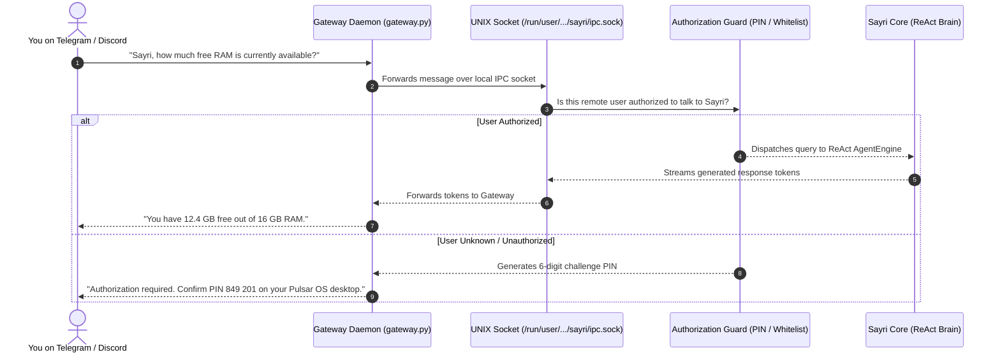

# Channel Gateways: Conceptual Guide & Authorization

A **Channel Gateway** in Sayri is an out-of-process background daemon that bridges Sayri's agentic core to external communication platforms (such as **Telegram**, **Discord**, **Matrix**, or **MCP** servers).

Gateways enable you to query your desktop, orchestrate subagents, or execute automated tasks directly from your smartphone or team chat channels.

---

## 1. How Does a Gateway Work? (Step-by-Step)



---

## 2. Unified Message Authorization System

To prevent unknown internet users from executing commands on your computer or consuming your AI token quota, every gateway plugin specifies an authorization policy in its manifest:

### Mode 1: `pairing_otp` (Desktop PIN Pairing)
* **Best for**: Private 1-on-1 bots (Telegram, Signal).
* **How it works**:
  1. The first time an unknown account messages the bot (`/start`), Sayri detects the new user ID.
  2. A notification banner appears on your Pulsar OS desktop in **Sayri Cajita -> Gateways**:
     ```text
     Telegram user @username (ID: 998231) requests access. PIN: 849 201. [Approve] [Reject]
     ```
  3. Once verified via `/pair <pin>` or approving the dialog, the user ID is saved permanently in `~/.config/sayri/authorizations.json`.

---

### Mode 2: `whitelist` (Declarative Users & Roles)
* **Best for**: Private team Discord servers or Matrix rooms.
* **How it works**:
  - You declare explicit user IDs (`allowed_users: ["123456789"]`) or allowed roles (`allowed_roles: ["Admin", "Developers"]`).
  - Messages from non-whitelisted users are dropped instantly without invoking the LLM.

---

### Mode 3: `public_support` (Community Support Subagents)
* **Best for**: Public Discord help channels (`#pulsar-support`).
* **How it works**:
  - The subagent is strictly bound to **`LEVEL_0_NO_EXEC`** (meaning **it is prohibited from running bash commands or touching files on your machine**).
  - Rate-limited per user (e.g. max 5 queries per minute) to prevent spam.

---

## 3. Gateway Plugin Manifest (`manifest.json`) & UI Specification

Every Gateway declares its capabilities, secrets, sandbox tier, and UI integration helpers in `manifest.json`:

```json
{
  "id": "sayri-gateway-telegram",
  "name": "Telegram Bot Gateway",
  "version": "1.1.0",
  "author": "jaimegh-es",
  "description": "Telegram communication bridge with Desktop OTP pairing.",
  "entrypoint": "gateway.py",
  "sandbox_level": "LEVEL_1_READONLY",
  "required_secrets": [
    "TELEGRAM_BOT_TOKEN"
  ],
  "authorization": {
    "mode": "pairing_otp",
    "allowed_users": [],
    "pairing_pin_required": true,
    "pin_expiration_seconds": 300,
    "rate_limit": {
      "max_requests_per_minute": 15,
      "burst": 3
    }
  },
  "ui": {
    "sync_instructions": "1. Open Telegram and message @YourBot (/start).\n2. Sayri will display a 6-digit PIN on this desktop screen.\n3. Reply with /pair <PIN> to authorize your account.",
    "actions": [
      {
        "id": "set_token",
        "label": "Configure Bot Token",
        "type": "secret_prompt",
        "secret_key": "TELEGRAM_BOT_TOKEN"
      },
      {
        "id": "view_pin",
        "label": "Show Pairing PIN",
        "type": "display_pin"
      }
    ]
  },
  "capabilities": [
    "receive_messages",
    "send_replies",
    "voice_audio_stream"
  ],
  "allowed_domains": [
    "api.telegram.org"
  ]
}
```

---

## 4. How to Manage Gateways in Sayri Cajita UI

In Sayri Cajita's **Gateways** tab:

1. **Sync Instructions Box**: Step-by-step guidance on how to connect external bots.
2. **Settings (⚙️)**: Interactive dialog to configure tokens (e.g. `TELEGRAM_BOT_TOKEN`) into the Zero-Plaintext Vault.
3. **Pair Device (🔑)**: Generates and displays the current 6-digit pairing PIN on your screen.
4. **Delete Gateway (🗑️)**: Uninstalls the gateway package and terminates its daemon with 1 click.
5. **Enable / Disable Switch**: Turns the background gateway daemon on or off.

---

## 5. UNIX Domain Socket IPC Protocol (`sayri.sock`)

Gateways and Sayri communicate via local JSON-Lines (NDJSON) over `/run/user/<UID>/sayri/ipc.sock`:

1. **Incoming Message (`INCOMING_MSG`)**:
   ```json
   {
     "type": "INCOMING_MSG",
     "session_id": "tg-9923841",
     "author_id": "992381",
     "author": "@username",
     "text": "How do I install a Flatpak package?"
   }
   ```
2. **Streaming Delta (`DELTA`)**:
   ```json
   {
     "type": "DELTA",
     "session_id": "tg-9923841",
     "token": "To install a Flatpak, run: pulsar-store install..."
   }
   ```
3. **Completion Event (`DONE`)**:
   ```json
   {
     "type": "DONE",
     "session_id": "tg-9923841",
     "full_text": "To install a Flatpak, run: pulsar-store install <id>"
   }
   ```

### 4.2 Security Specification: Desktop-Only OTP Pairing Protocol

To prevent unauthorized users from hijacking private OS assistants, Sayri implements a **Zero-Leakage OTP Protocol**:

1. **Local Screen Generation**: Sayri Cajita generates a random 6-digit OTP stored in `~/.config/sayri/pairing_pin.json`.
2. **Strict Privacy**: The remote gateway daemon **NEVER** echoes the PIN to the chat when a stranger sends `/start` or `/help`.
3. **Mutual Handshake**:
   - The user copies the `/pair <PIN>` command from their local desktop.
   - The bot receives `/pair <PIN>`, verifies against `pairing_pin.json`, adds the Telegram user ID to `~/.config/sayri/authorizations.json`, and confirms pairing.
4. **UNIX Socket Streaming**: Incoming queries are routed over `/run/user/<uid>/sayri/sayri.sock` via `INCOMING_MSG` JSON payloads directly to `AgentEngine` with synchronous response resolution.
