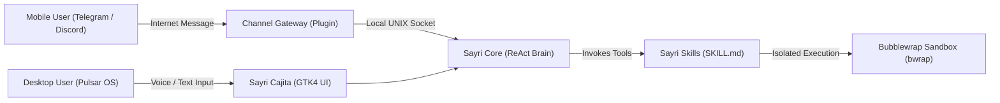
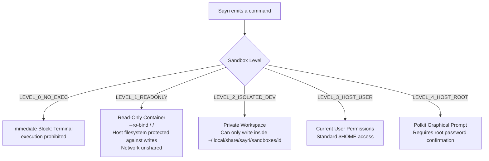

# Sayri: Conceptual Guide & System Architecture

Sayri is the native intelligent AI copilot engineered specifically for **Pulsar OS**. It is designed from the ground up to combine the power of modern Language Models (LLMs) with full user control, privacy, and operating system sandboxing.

---

## 1. Core Concepts Explained

Understanding Sayri's architecture comes down to three primary concepts:



### What is a Skill? (New Superpowers for Sayri)
By default, Sayri knows how to reason and converse, but **does not know how to interact with specific external tools or private workflows** (like querying documentation, searching the web, or filing a GitHub issue).
* A **Skill** is a modular package containing a **`SKILL.md`** manifest and execution scripts (Python or Bash).
* In the `SKILL.md` file, we instruct Sayri: *"When the user asks for weather or technical documentation, execute `search.py` with the query argument"*.
* When a user makes a request, Sayri reads the `SKILL.md`, executes the script inside an isolated **Bubblewrap container**, receives structured JSON output, and responds.
* **In summary**: A Skill gives Sayri **new tools and capabilities** to perform tasks on your machine.

---

### What is a Channel Gateway? (Remote Access Bridge)
A Skill is invoked locally when you are seated in front of your desktop using **Cajita**. But what if you are away from your desk and want to ask your computer something via **Telegram** or **Discord**?
* A **Gateway** is a background daemon that connects to your Telegram or Discord bot.
* When you send a message from your phone, the Gateway forwards it to Sayri over a high-performance internal channel: a **local UNIX Domain Socket** (`/run/user/<UID>/sayri/ipc.sock`).
* Sayri processes the query, executes any necessary skills, and streams the response back to the Gateway to reply in your chat room.
* **In summary**: A Gateway is a **communication bridge** that lets you talk to Sayri from external apps.

---

## 2. What is Bubblewrap (`bwrap`) & How Does it Protect Your PC?

When Sayri or a subagent executes code from a skill, **it never runs directly on your host desktop with unrestricted privileges**.

Sayri isolates every execution using **Bubblewrap (`bwrap`)**, the containerization engine created by GNOME and Flatpak:



### Why is Bubblewrap Secure?
1. **Strict Read-Only Root (`--ro-bind / /`)**: Subagents can read shared system binaries (`python3`, `node`, `gcc`), but **any write or delete attempt to `/etc`, `/usr` or your `$HOME` directory is intercepted and blocked by the Linux kernel with `EROFS: Read-only file system`**.
2. **Private Workspace (`--bind sandboxes/<id>`)**: In `LEVEL_2_ISOLATED_DEV`, the subagent has write permissions ONLY inside its designated sandbox folder in `~/.local/share/sayri/sandboxes/<id>`.
3. **Network Boundary (`--unshare-net`)**: If a task does not require internet, the container's network namespace is detached, preventing telemetry leaks or data exfiltration.
4. **Ephemeral RAM Filesystem (`--tmpfs /tmp`)**: Temporary files exist only in RAM and are destroyed when the process terminates.

---

## 3. Zero-Plaintext Secrets Manager (Token Shield)

To ensure private tokens (like `TELEGRAM_BOT_TOKEN`, `DISCORD_BOT_TOKEN`, or API keys) **are NEVER leaked to third-party LLM providers** or saved in chat logs:

1. Credentials are saved in the **Vault** tab of Sayri Cajita (`~/.config/sayri/vault.json`, permissions `0600`).
2. Sayri encrypts them using hardware-derived keys (`/etc/machine-id` + UID).
3. When the LLM generates an execution plan, Sayri redacts the secret into an opaque placeholder (e.g. `$SECRET:TELEGRAM_BOT_TOKEN`).
4. When launching the Bubblewrap container, Sayri injects the real value strictly into the child process environment variables. **The LLM never sees the plaintext token**.

---

## 4. System Directory Layout

```text
/usr/share/sayri/lib/sayri/          # Core Sayri Python library
├── app.py                          # GTK4 Application & IPC server
├── cajita.py                       # Unified Cajita UI Overlay (Input & Drawer)
├── domain/                         # Domain Logic
│   ├── agent_engine.py             # ReAct reasoning loop
│   ├── secrets_manager.py          # Zero-Plaintext Vault
│   ├── agent_creator.py            # Subagent factory
│   └── skills_scanner.py           # SKILL.md parser
└── adapters/                       # System Adapters
    ├── sandbox/executor.py         # Bubblewrap (bwrap) & Polkit executor
    └── storage/sqlite_sessions.py  # SQLite database (sayri.db)

~/.config/sayri/                    # User Configuration
├── config.json                     # General preferences
├── vault.json                      # Encrypted credentials store
├── authorizations.json             # Authorized Telegram/Discord users
├── agents/                         # Custom subagent profiles
└── skills/                         # Installed custom skills

~/.local/share/sayri/               # Runtime State
├── sayri.db                        # SQLite chat database
└── sandboxes/<agent_id>/           # Bubblewrap isolated workspaces
```
