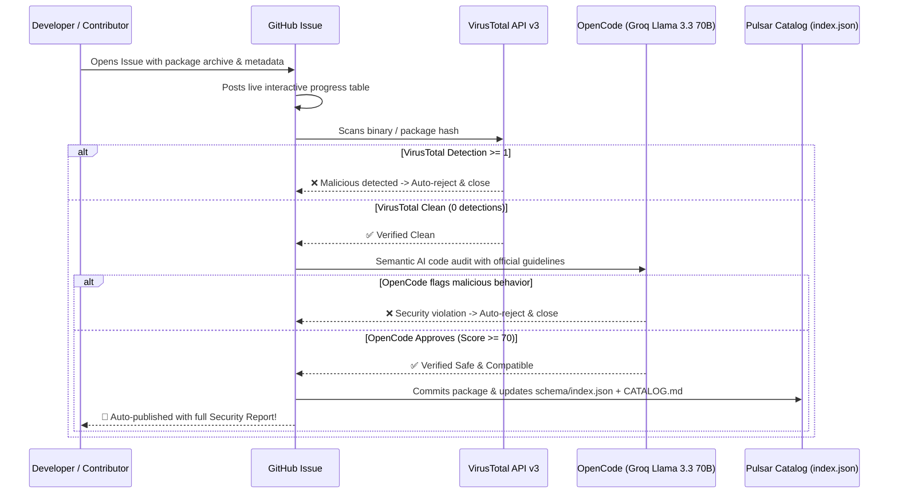

# 🌌 Pulsar Store & Security Shield Architecture

The **Pulsar Store** is the unified software distribution platform for Pulsar OS, hosting **Flatpak Applications**, **GNOME Shell Extensions**, and **Sayri AI Skills & Plugins**.

---

## 🚀 1. Issue-Ops Submission Workflow

Developers submit packages by simply opening an Issue on GitHub:
- **`submit-app.yml`**: Flatpak applications (`.flatpak` / `.flatpakref`).
- **`submit-extension.yml`**: GNOME Shell extensions (`.zip` with `metadata.json` and `extension.js`).
- **`submit-skill.yml`**: Sayri AI Skills (`.zip` with `SKILL.md`, `scripts/`, `requirements.txt`).
- **`submit-plugin.yml`**: Sayri Gateways (`.zip` with `plugin.yaml`).

---

## 🛡️ 2. OpenCode + VirusTotal Security Pipeline

When an Issue is opened, GitHub Actions launches `scripts/audit.js`:



---

## ⚡ 3. Universal CLI Helper (`pulsar-store`)

Users can manage all 4 ecosystems with a single CLI command:

```bash
# Check updates across Flatpaks, GNOME Extensions, and Sayri Skills/Plugins
pulsar-store check

# Batch update all packages
pulsar-store update

# 1-Click install
pulsar-store install <package-id>
```
